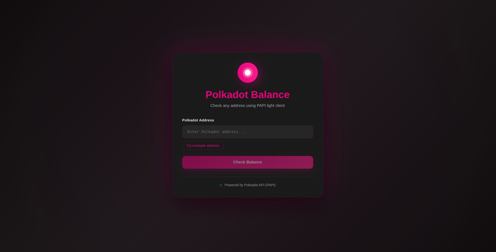

# Polkadot Balance Checker App

A full-stack application for fetching and displaying Polkadot account balances.

Find a begineer friendly starter guide here: https://dev.to/mulandi_cecilia/getting-started-with-polkadot-api-papi-building-a-balance-checker-41o5

## Live Demos

- **Frontend:** [https://polkadot-balance-checker.vercel.app/](https://polkadot-balance-checker.vercel.app/)

  

- **API Backend:** [https://polkadot-balance-checker-3.onrender.com](https://polkadot-balance-checker-3.onrender.com)

Try the API:

```bash
curl https://polkadot-balance-checker-3.onrender.com/api/balance/16JGzEsi8gcySKjpmxHVrkLTHdFHodRepEz8n244gNZpr9J
```

## Project Structure

```
├── backend/          # Express API server
└── frontend/         # React client (Vite)
```

## Quick Start

### Prerequisites

- Node.js 20.6.0+ or Bun
- npm, yarn, or bun package manager

### Setup

1. **Clone the repository:**

```bash
git clone https://github.com/CECILIA-MULANDI/polkadot-balance-checker.git
cd polkadot-balance-checker
```

2. **Install dependencies for both projects:**

**Backend:**

```bash
cd backend
bun install
```

**Frontend:**

```bash
cd ../frontend
bun install
```

### Running the Application

#### Backend (Port 3001)

```bash
cd backend
npx tsx server.ts
```

The backend will be available at `http://localhost:3001`

#### Frontend (Port 5174)

```bash
cd frontend
bun run dev
```

The frontend will be available at `http://localhost:5174`

## API Endpoints

### Health Check

```
GET /
```

Returns API status.

### Get Balance

```
GET /api/balance/:address
```

Fetches the balance for a Polkadot address.

**Example:**

```bash
curl http://localhost:3001/api/balance/16JGzEsi8gcySKjpmxHVrkLTHdFHodRepEz8n244gNZpr9J
```

**Response:**

```json
{
  "success": true,
  "data": {
    "free": 123.45,
    "reserved": 0,
    "frozen": 0,
    "total": 123.45
  }
}
```

## Tech Stack

**Backend:**

- Express.js
- TypeScript
- Polkadot API

**Frontend:**

- React
- Vite
- TypeScript

## Environment Variables

### Backend

Create a `.env` file in the `backend/` directory:

```env
PORT=3001
```

### Frontend

Create a `.env` file in the `frontend/` directory:

```env
VITE_API_URL=http://localhost:3001
```

For production, update to your deployed backend URL:

```env
VITE_API_URL=https://polkadot-balance-checker-3.onrender.com
```

## Deployment

Both frontend and backend are deployed separately:

- **Backend:** Deployed on [Render](https://render.com)
  - [https://polkadot-balance-checker-3.onrender.com](https://polkadot-balance-checker-3.onrender.com)
- **Frontend:** Deployed on [Vercel](https://vercel.com)
  - [https://polkadot-balance-checker.vercel.app/](https://polkadot-balance-checker.vercel.app/)

## Author

[CECILIA-MULANDI](https://github.com/CECILIA-MULANDI)
